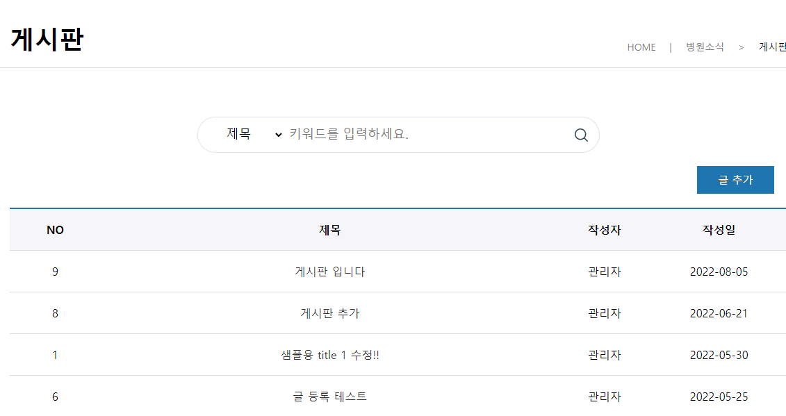

# Project 2
## 아산안과 웹 애플리케이션

- 개발 환경 : Spring 5.0.7, JAVA 1.8, Apache Tomcat 9.0, Oracle XE 11g
- 주요 기술 : Java/JSP, Spring, mybatis, jUnit4, JavaScript, HTML/CSS, MVC2 Pttern, Jquery, lombok
- 수행 기간 : 2022.06.14 ~ 2022.06.30
- 참여 인원 : Frontend (3명) / Backend (1명)
- 구현 내용  

    1. 메인화면

        

    # 
    2. 회원기능

        
        * 중복확인 버튼을 누르면 데이터베이스에서 같은 아이디기 있는지 select 하여 리턴값이 있을 경우에는 controller에서 ck의 값을 null처리하고, '사용중인 아이디' 메세지를 전달, 리턴되는 값이 없을 경우에는 ck의 값을 yes로 전달하고 '사용 가능한 아이디' 메세지를 전달하여 ck값이 있을 때만 회원가입 처리
        * 자바스크립트를 활용하여 비밀번호와 비밀번호 확인 값이 동일하면 회원가입처리
        * controller에서 BCryptPasswordEncoder를 Inject하여 입력한 비밀번호 값을 인코딩하여 데이터베이스에 전달

    #
    3. 게시판

          
        * 게시판 목록은 데이터베이스에서 데이터를 리스트로 받아 view에서 반복문으로 처리
        ##
        
        * 게시판 글 추가나 수정, 삭제는 관리자로 로그인할 때만 가능하게 구현하고 작성일 기준 내림차순으로 정렬

    #
    4. 자료실

        
        * 데이터 목록은 데이터베이스에서 데이터를 리스트로 받아 view에서 반복문으로 처리
        ##
        
        
        * controller에서 MultipartFile를 통한 파일 전송

     #
    5. Q&A

           
        * 목록에 문의글과 답변글을 리스트로 받아 view에서 반복문으로 처리
        * 답변은 관리자 아이디로 로그인할 때만 가능하게 구현하고 질문글 아래 정렬되게 처리, 질문을 삭제하면 답변까지 삭제되게 구현

    #
    6. 예약

        
        * 예약목록은 관리자 마이페이지에서만 확인이 가능하며, Mapper의 update문으로 예약확정처리
        ##
        
          
    
        * 예약조회는 이름, 생년월일로 조회하거나 예약번호로 조회가증하도록 구현
        
